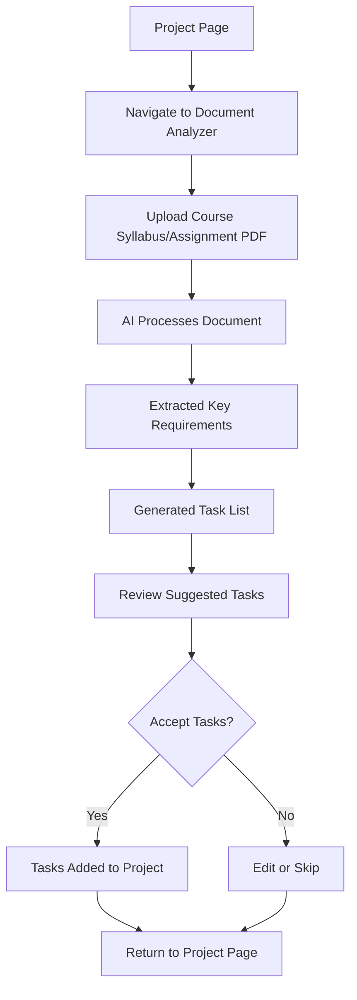
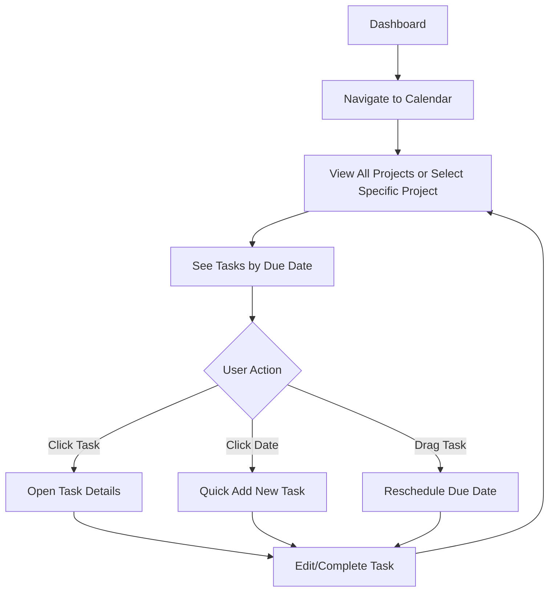

# Product Requirements Document (PRD)
# Student Flow PM

**Version:** 1.0  
**Last Updated:** January 25, 2026  
**Status:** Active Development

---

## Executive Summary

**Student Flow PM** is a next-generation project management platform designed specifically for students. Unlike overwhelming enterprise tools (Jira, ClickUp) or overly simplistic alternatives (Google Classroom, basic Notion), Student Flow PM strikes the perfect balance by offering AI-powered assistance, context-aware management, and data-driven insights tailored to academic workflows.

The platform eliminates project friction through intelligent automation, provides qualitative progress visibility, and significantly reduces administrative burden—enabling students to focus on actual work rather than project logistics.

---

## Vision & Goals

### Vision Statement
Empower students to manage academic projects with enterprise-grade tools optimized for simplicity, backed by AI that understands academic context.

### Primary Goals
1. **Eliminate Friction**: AI-assisted project setup and task generation minimize startup inertia
2. **Context-Aware Management**: NotebookLM-inspired intelligence understands project context and relationships
3. **Data-Driven Insights**: Automated analytics and visual progress tracking replace manual reporting
4. **Student-Centric Design**: Intuitive UX designed for students, not corporate PMs

---

## Problem Statement

### Target Audience
- **Primary**: College and university students managing individual or group academic projects
- **Secondary**: High school students working on advanced coursework or personal projects
- **Tertiary**: Academic teams and study groups

### Core Problems Addressed

| Problem | Current Solutions Fall Short | Student Flow PM Solution |
|---------|------------------------------|-------------------------|
| **User Inertia** | Complex tools require extensive setup; simple tools lack structure | AI-powered project kickoff with suggested timelines and tasks |
| **Progress Visibility** | Manual updates required; no qualitative metrics | Automated progress tracking with visual dashboards and AI-generated insights |
| **Administrative Burden** | Time spent on PM overhead > actual work | Smart automation for routine tasks, file organization, and status updates |
| **Context Switching** | Tools don't understand academic workflows | Built-in understanding of academic calendars, deadlines, and project types |

---

## User Personas

### Persona 1: Sarah - The Organized Overachiever
- **Background**: Junior CS student managing 4-5 projects per semester (coursework + side projects)
- **Pain Points**: Spends too much time organizing, struggles to visualize progress across multiple projects
- **Goals**: Automated project tracking, quick status overviews, minimal manual updates
- **Key Features**: Dashboard overview, AI suggestions, calendar view, data insights

### Persona 2: Marcus - The Collaborative Team Lead
- **Background**: Senior engineering student leading a capstone team (5 members)
- **Pain Points**: Difficult to coordinate team tasks, track who's working on what, communicate progress
- **Goals**: Clear task assignments, team messaging, shared resources, accountability tracking
- **Key Features**: Project messaging, task management, resource sharing, collaborative workspaces

### Persona 3: Emma - The Visual Learner
- **Background**: Sophomore design student who thinks in timelines and visual progress
- **Pain Points**: Text-heavy PM tools don't show the "big picture," hard to see deadline proximity
- **Goals**: Visual timeline, progress charts, intuitive drag-and-drop, color-coded priorities
- **Key Features**: Calendar view, data visualizations, project space, drag-and-drop tasks

---

## Technical Architecture

### Technology Stack

#### Frontend (`apps/web`)
- **Framework**: React 19 + Vite
- **Routing**: React Router DOM v7
- **Styling**: TailwindCSS 3.4 with custom configuration
- **State Management**: TanStack React Query v5
- **Authentication**: Better Auth v1.4
- **Drag & Drop**: DnD Kit
- **Build Tool**: Vite 7

#### Backend (`apps/api`)
- **Runtime**: Node.js + TypeScript
- **Framework**: Express 4
- **Database**: PostgreSQL via Drizzle ORM
- **Authentication**: Better Auth v1.2
- **AI Services**: 
  - Google Gemini API (`@google/generative-ai`)
  - Groq SDK
- **File Uploads**: Multer
- **Validation**: Zod
- **CORS**: Configured for cross-origin requests

#### Deployment
- **Frontend Hosting**: Vercel (Serverless)
- **Backend Hosting**: Vercel (Serverless Functions)
- **Database**: Neon (Serverless PostgreSQL)
- **Repository**: GitHub

### Monorepo Structure
```
student-flow-monorepo/
├── apps/
│   ├── web/          # React frontend
│   └── api/          # Express backend
├── packages/         # Shared packages
└── testsprite_tests/ # Test automation
```

---

## Core Features Specification

### 1. Authentication & User Management

#### 1.1 User Authentication
- **Registration**: Email-based signup with validation
- **Login**: Secure authentication via Better Auth
- **Password Recovery**: Forgot password → email confirmation → reset flow
- **Profile Setup**: Guided onboarding after registration

#### 1.2 Account Management
- User profile editing
- Account settings (email, password, preferences)
- Notification preferences
- Account deletion with confirmation flow

**Implementation Status**: ✅ Fully Implemented
**Routes**: 
- `/login`, `/register`, `/forgot-password`, `/reset-password`
- `/profile-setup`, `/settings/account`, `/settings/profile`

---

### 2. Project Management

#### 2.1 Project Creation Wizard
Multi-step guided project creation:

**Step 1: Project Details**
- Project name, description, type (individual/group)
- Course/subject association
- Priority level

**Step 2: Timeline Planning**
- Start date, due date
- Milestone definition
- AI-suggested timeline breakdown

**Step 3: Review & Confirm**
- Summary of project configuration
- Initial task list generated by AI
- Resource allocation

**Implementation Status**: ✅ Fully Implemented
**Routes**: `/create-project`, `/create-project/timeline`, `/create-project/review`

#### 2.2 Project Dashboard
- **Overview**: Quick stats (tasks completed, progress %, days remaining)
- **Active Projects**: Card-based layout with status indicators
- **Quick Actions**: Create project, view calendar, access archived projects

**Implementation Status**: ✅ Fully Implemented
**Route**: `/` (Dashboard)

#### 2.3 Project Details View
- **Task Management**: Kanban-style board with drag-and-drop
- **AI Sidebar**: Context-aware suggestions for next steps
- **Progress Tracking**: Visual progress indicators
- **Quick Stats**: Completion rates, time tracking

**Implementation Status**: ✅ Fully Implemented
**Route**: `/project`

#### 2.4 Project Settings
- Edit project details
- Archive/restore projects
- Delete projects (with confirmation)
- Access control (for group projects)

**Implementation Status**: ✅ Fully Implemented
**Routes**: `/project/settings`, `/project/delete`, `/archived`, `/project/restore`

---

### 3. Task Management

#### 3.1 Task CRUD Operations
- Create, read, update, delete tasks
- Task fields: title, description, priority, status, due date, assignee
- Subtask support with nested hierarchies

#### 3.2 Task Organization
- **Statuses**: Todo, In Progress, Review, Done
- **Priorities**: Low, Medium, High, Urgent
- **Labels/Tags**: Custom categorization
- **Dependencies**: Task relationships

#### 3.3 Task Details Page
- Full task view with all metadata
- Comments and activity log
- Attached resources and files
- Related tasks and dependencies

**Implementation Status**: ✅ Fully Implemented
**Routes**: `/project/task/:taskId`
**API**: `tasks.routes.ts`, `tasks.service.ts`

---

### 4. AI-Powered Features

#### 4.1 AI Project Suggestions
- **Smart Task Generation**: Analyzes project description to suggest task breakdown
- **Timeline Recommendations**: Proposes realistic milestone dates
- **Next Actions**: Context-aware "what should I work on next?" suggestions

#### 4.2 Document Analyzer
- **File Upload**: Support for PDFs, docs, slides
- **Content Extraction**: AI reads uploaded documents
- **Task Generation**: Auto-create tasks from syllabus, assignment PDFs, rubrics
- **Key Points Extraction**: Summarizes important requirements

**Implementation Status**: ✅ Fully Implemented
**Route**: `/ai/analyze`
**API**: `ai.routes.ts`, `ai.service.ts` (Gemini & Groq integration)

#### 4.3 Progress Insights
- AI-generated progress summaries
- Risk identification (e.g., tasks behind schedule)
- Productivity pattern analysis

---

### 5. Calendar & Timeline

#### 5.1 Project Calendar View
- **Monthly View**: All project deadlines and milestones
- **Multi-Project Support**: Toggle between individual projects or "All Projects"
- **Color Coding**: Visual distinction by project or priority
- **Quick Add**: Click-to-create tasks on calendar dates

#### 5.2 Task Due Dates
- Calendar integration for task deadlines
- Overdue task highlighting
- Upcoming deadline notifications

**Implementation Status**: ✅ Fully Implemented
**Route**: `/calendar`
**Components**: `ProjectCalendarPage.tsx`

---

### 6. Resource Management

#### 6.1 File & Link Repository
- **File Uploads**: Attach documents, PDFs, images to projects
- **Link Management**: Save relevant URLs, research papers, references
- **Organization**: Tag and categorize resources
- **Search**: Quick resource lookup

#### 6.2 Resource Linking
- Attach resources to specific tasks
- Shared resource library across project
- Version tracking for updated files

**Implementation Status**: ✅ Fully Implemented
**Routes**: `/project/:projectId/resources`, `/project/resources/add`
**API**: `resources.routes.ts`, `resources.service.ts`

> [!WARNING]
> **Known Limitation**: File uploads use local `uploads/` directory. Vercel serverless deployment requires migration to cloud storage (S3, UploadThing) for production.

---

### 7. Collaboration Features

#### 7.1 Project Messaging
- **Real-time Chat**: Project-specific messaging channels
- **Thread Support**: Organized conversation threads
- **@Mentions**: Notify specific team members
- **File Sharing**: Attach files directly in messages

#### 7.2 Notifications
- **System Notifications**: Task assignments, deadline reminders, updates
- **Activity Feed**: Recent project activity log
- **Notification Settings**: Granular control over notification types and delivery

**Implementation Status**: ✅ Fully Implemented
**Routes**: `/project/messages`, `/notifications`, `/settings/notifications`
**API**: `messaging.routes.ts`, `notifications.routes.ts`

---

### 8. Data Insights & Analytics

#### 8.1 Project Analytics Dashboard
- **Progress Charts**: Visual representation of completion over time
- **Velocity Tracking**: Tasks completed per week/sprint
- **Time Allocation**: Breakdown by task category or priority
- **Burndown Charts**: Academic-friendly deadline tracking

#### 8.2 Personal Productivity Insights
- Work pattern analysis (when are you most productive?)
- Project completion rate trends
- Comparison across multiple projects

**Implementation Status**: ✅ Fully Implemented
**Route**: `/data-insight`
**Components**: `DataInsightPage.tsx`

---

### 9. Project Space (Collaborative Workspace)

#### 9.1 Shared Workspace
- Dedicated collaborative area for group projects
- Shared resource library
- Team task overview
- Quick access to messaging and calendar

**Implementation Status**: ✅ Fully Implemented
**Route**: `/project/space`
**Components**: `ProjectSpacePage.tsx`

---

## User Flows

### Primary User Flow: Creating a New Project

```mermaid
flowchart TD
    A[Dashboard] --> B[Click "Create Project"]
    B --> C[Project Details Form]
    C --> D[Timeline Planning]
    D --> E[AI Suggests Tasks & Milestones]
    E --> F[Review & Confirm]
    F --> G[Project Created]
    G --> H[Redirect to Project Page]
    H --> I[View Tasks & AI Suggestions]
```

### Secondary User Flow: AI Document Analysis



### Tertiary User Flow: Calendar Task Management



---

## Success Metrics (KPIs)

### User Engagement Metrics
- **Daily Active Users (DAU)**: Target 60% of registered users active weekly
- **Project Creation Rate**: Average 2-3 projects per user per semester
- **Task Completion Rate**: >70% of created tasks marked complete
- **AI Feature Adoption**: >50% of users leverage AI suggestions within first week

### Quality Metrics
- **Time to First Task**: <5 minutes from project creation
- **AI Suggestion Acceptance**: >40% of AI-generated tasks accepted without modification
- **User Retention**: 80% retention rate from semester start to semester end

### Performance Metrics
- **Page Load Time**: <2 seconds for dashboard
- **API Response Time**: <500ms for typical requests
- **Uptime**: 99.5% availability

---

## Non-Functional Requirements

### Performance
- Frontend builds optimized via Vite code splitting
- Backend uses database connection pooling
- React Query caching for reduced API calls

### Security
- Better Auth handles authentication with secure token management
- Input validation via Zod schema validation
- CORS configured to prevent unauthorized access
- SQL injection protection via Drizzle ORM parameterized queries

### Scalability
- Serverless architecture (Vercel) auto-scales with traffic
- Database (Neon) supports auto-scaling storage
- Stateless backend design enables horizontal scaling

### Accessibility
- WCAG 2.1 AA compliance target
- Keyboard navigation support
- Screen reader compatibility
- Sufficient color contrast ratios

---

## Future Roadmap

### Phase 2 Features (Next 6 Months)
- [ ] Mobile app (React Native)
- [ ] Cloud file storage integration (S3/UploadThing)
- [ ] Real-time collaboration (WebSockets)
- [ ] Advanced AI: Automatic progress reports generation
- [ ] Integration with university LMS (Canvas, Blackboard)

### Phase 3 Features (12 Months)
- [ ] Team analytics and performance tracking
- [ ] Custom workflow templates for common project types
- [ ] API for third-party integrations
- [ ] Advanced AI: Predictive deadline risk assessment

---

## Technical Constraints & Limitations

### Current Known Issues
1. **File Uploads**: Local storage incompatible with Vercel serverless (documented in DEPLOYMENT.md)
2. **Real-time Updates**: Polling-based, not true WebSocket implementation
3. **Authentication**: Better Auth configuration requires careful environment variable setup

### Dependencies
- Requires Google Gemini API key for AI features
- PostgreSQL database (Neon or compatible)
- Node.js runtime for backend
- Modern browser with ES6+ support for frontend

---

## Appendix

### API Routes Overview

#### Authentication & Users
- `POST /auth/register` - User registration
- `POST /auth/login` - User login
- `GET /users/profile` - Get user profile
- `PUT /users/profile` - Update user profile
- `DELETE /users/account` - Delete account

#### Projects
- `GET /projects` - List all projects
- `POST /projects` - Create project
- `GET /projects/:id` - Get project details
- `PUT /projects/:id` - Update project
- `DELETE /projects/:id` - Delete project
- `POST /projects/:id/archive` - Archive project
- `POST /projects/:id/restore` - Restore archived project

#### Tasks
- `GET /tasks` - List all tasks
- `POST /tasks` - Create task
- `GET /tasks/:id` - Get task details
- `PUT /tasks/:id` - Update task
- `DELETE /tasks/:id` - Delete task
- `PATCH /tasks/:id/status` - Update task status
- `POST /tasks/:id/reorder` - Reorder tasks

#### AI Services
- `POST /ai/generate-suggestions` - Generate AI task suggestions
- `POST /ai/analyze-document` - Analyze uploaded document
- `POST /ai/generate-timeline` - Generate project timeline

#### Resources
- `GET /resources` - List resources
- `POST /resources` - Upload resource
- `DELETE /resources/:id` - Delete resource

#### Messaging
- `GET /messages/:projectId` - Get project messages
- `POST /messages` - Send message
- `DELETE /messages/:id` - Delete message

#### Notifications
- `GET /notifications` - Get user notifications
- `PATCH /notifications/:id/read` - Mark as read
- `PUT /settings/notifications` - Update notification preferences

---

## Conclusion

Student Flow PM represents a paradigm shift in academic project management—combining enterprise-grade capabilities with student-centric design and AI-powered intelligence. By eliminating friction, providing context-aware assistance, and delivering actionable insights, Student Flow PM empowers students to spend less time managing projects and more time doing exceptional work.

**Ready for deployment**, the platform is built on modern technologies with proven scalability and security. The comprehensive feature set addresses core student pain points while maintaining an extensible architecture for future enhancements.

---

**Document Owner**: Khafidh (Development Team)  
**Stakeholders**: Student users, academic institutions, development team  
**Next Review Date**: End of current academic semester
